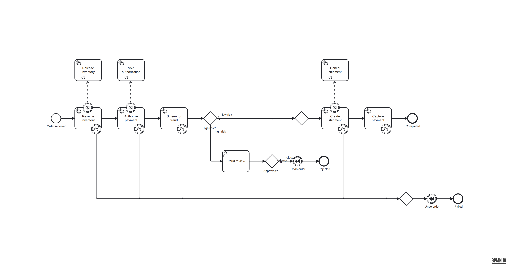

# temporal-camunda

The **same order-fulfilment saga**, implemented twice: once on [Temporal](https://temporal.io),
once on [Camunda 8](https://camunda.com). Same domain, same fake services, same scenario
battery, same report format — so every difference you see comes from the orchestrator.

👉 **[docs/comparison.md](docs/comparison.md) is the point of the repo.** It records what
actually differed when the two were built and run, not what the marketing pages claim.

## The saga

```
reserve inventory → authorize payment → fraud screen
                                            │
                              high risk ────┴──── low risk
                                   │                 │
                            human review             │
                          approve │ reject           │
                                  │      └── undo everything → REJECTED
                                  └────────┬─────────┘
                                           │
                                  create shipment → capture payment → COMPLETED
```

Any step can fail. When one does after earlier steps have already had effects, those
effects are undone in reverse: cancel the shipment, void the authorization, release the
reservation.



That diagram is the Camunda implementation. The Temporal implementation of the same thing
is [`temporal/src/workflows.ts`](temporal/src/workflows.ts) — one function, ~160 lines.
That contrast *is* the comparison.

## Layout

| Path | What it is |
| --- | --- |
| `shared/` | Domain types, the fake inventory/payment/fraud/shipping services, the scenario battery, and the report renderer. Both engines import this, unchanged. |
| `temporal/` | Workflow, activities, worker, scenario driver, and a time-skipping test suite. |
| `camunda/` | BPMN model, job workers, deploy script, scenario driver. |
| `infra/` | Docker Compose for Camunda 8 Self-Managed. |
| `docs/` | The write-up. |

Both implementations write every side effect to a shared append-only log (`.effects/`),
which is how a scenario can assert *"compensation actually ran, in this order"* without
caring which engine produced it.

## Scenarios

Six cases, run against both engines:

| Scenario | What it probes |
| --- | --- |
| `happy-path` | Baseline — no failures, no humans. |
| `transient-payment` | Retries. Payment fails twice, succeeds on the third attempt. |
| `shipping-fails` | Compensation after retries are exhausted — two effects to unwind. |
| `capture-fails` | Deepest compensation path — three effects to unwind. |
| `fraud-approved` | Human-in-the-loop, approved. |
| `fraud-rejected` | Human rejection triggers compensation as a *business* outcome. |

## Running it

Prerequisites: Node 22+, and for the Camunda side Docker with ~3 GB free for
Elasticsearch. Then `npm install && npm run build`.

### Temporal

```bash
npm run temporal:test           # full suite, no server, no Docker, ~2s

npm run temporal:up             # terminal 1 — dev server (single binary)
npm run temporal:worker         # terminal 2
npm run temporal:scenarios      # terminal 3
```

UI at <http://localhost:8233>.

### Camunda 8

```bash
npm run camunda:up              # Zeebe + Operate + Tasklist + Elasticsearch (~40s)
npm run camunda:deploy          # push the BPMN model to the broker
npm run camunda:worker          # terminal 2 — job workers
npm run camunda:scenarios       # terminal 3
```

Operate at <http://localhost:8088/operate>, Tasklist at <http://localhost:8088/tasklist>
(`demo` / `demo`). `npm run camunda:down` tears it down.

To regenerate the BPMN after editing the generator: `npm run camunda:model`. In real life
you would edit the model in [Camunda Modeler](https://camunda.com/download/modeler/) and
commit the `.bpmn`; the generator exists because this repo was built headless.

## Results

Both engines pass all six scenarios. The interesting column is `LIFO` — whether
compensations ran in strict reverse order:

```
=== TEMPORAL — order saga scenario battery ===

SCENARIO             OUTCOME     COMPENSATED                    LIFO   ATTEMPTS       RESULT
--------------------------------------------------------------------------------------------
happy-path           completed   —                              —      —              PASS
transient-payment    completed   —                              —      payment×3      PASS
shipping-fails       failed      payment → inventory            yes    shipping×3     PASS
capture-fails        failed      shipping → payment → inventory yes    capture×3      PASS
fraud-approved       completed   —                              —      —              PASS
fraud-rejected       rejected    payment → inventory            yes    —              PASS

6/6 scenarios passed

=== CAMUNDA 8 — order saga scenario battery ===

SCENARIO             OUTCOME     COMPENSATED                    LIFO   ATTEMPTS       RESULT
--------------------------------------------------------------------------------------------
happy-path           completed   —                              —      —              PASS
transient-payment    completed   —                              —      payment×3      PASS
shipping-fails       failed      inventory → payment            no     shipping×3     PASS
capture-fails        failed      inventory → payment → shipping no     capture×3      PASS
fraud-approved       completed   —                              —      —              PASS
fraud-rejected       rejected    inventory → payment            no     —              PASS

6/6 scenarios passed
```

Same outcomes, same effects undone — but Temporal unwinds a stack sequentially and Camunda
fans the handlers out concurrently. See [docs/comparison.md](docs/comparison.md) for that
and eight other findings.

## Versions

Temporal CLI 1.8.2 (server 1.31.2) · TypeScript SDK 1.22.0 · Camunda 8.8.35 ·
`@camunda8/sdk` 8.8.13 · Node 22.
